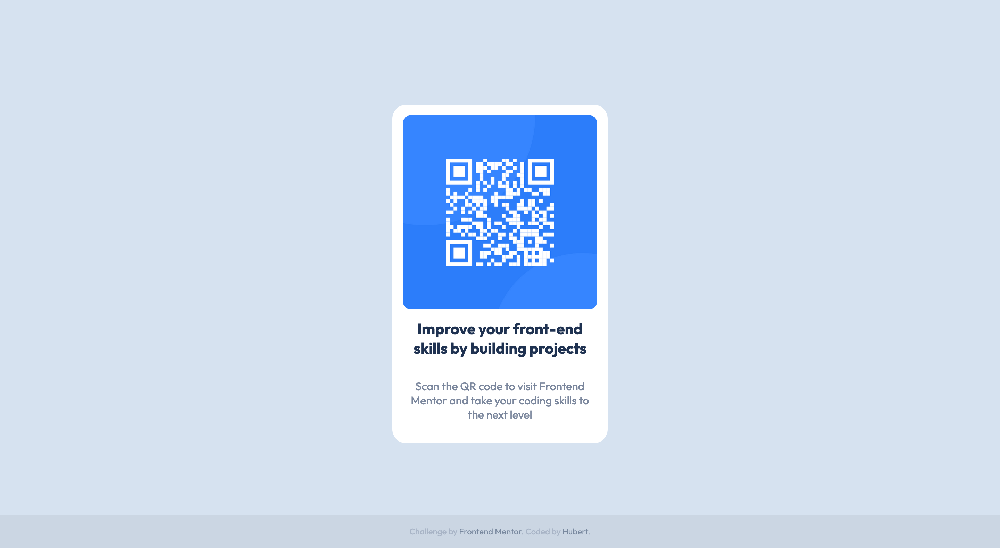

# Frontend Mentor - QR code component solution

This is a solution to the [QR code component challenge on Frontend Mentor](https://www.frontendmentor.io/challenges/qr-code-component-iux_sIO_H). Frontend Mentor challenges help you improve your coding skills by building realistic projects. 

## Table of contents

- [Overview](#overview)
  - [Screenshot](#screenshot)
  - [Links](#links)
- [My process](#my-process)
  - [Built with](#built-with)
  - [What I learned](#what-i-learned)
  - [Continued development](#continued-development)
- [Author](#author)
- [Acknowledgments](#acknowledgments)

## Overview

### Screenshot

### Links

- Solution URL: [https://github.com/HubertSzymanski5/frontend-mentor-qr-code-component](https://github.com/HubertSzymanski5/frontend-mentor-qr-code-component)
- Live Site URL: [TODO](TODO)

## My process

### Built with

- Semantic HTML5 markup
- CSS
- Flexbox

### What I learned

I used proposed by Lucas VS Code plugin `px to rem` to make whole view more
responsible. This project was easier than previous, so basically I managed to do it
on my own without googling anything - this small project ensured me that I have
understood basics from previous one.

In this particular project I'm not sure if there's a difference between desktop and mobile design. However I managed to play a bit with scalling (not included in solution).

### Continued development

Deeper understanding of CSS positioning, which still confuses me sometimes.

## Author

- Frontend Mentor - [@HubertSzymanski5](https://www.frontendmentor.io/profile/HubertSzymanski5)

## Acknowledgments

Thanks for Lucas for giving me quick feedback after my first upload. It pointed me
new things to think about during coding and motivated to move on.
